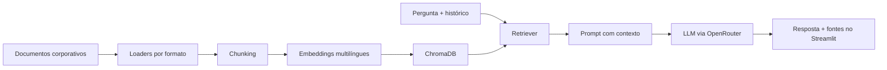

# 🤖 Alura Agente

Agente corporativo de IA que responde em português a perguntas sobre documentos internos.
Ele combina recuperação semântica com geração de texto (RAG), mostra os arquivos usados
como fontes e informa quando a resposta não está na base.

Repositório público: [github.com/alexxnunes/alura-agente](https://github.com/alexxnunes/alura-agente)

## Funcionalidades

- Leitura de PDF, Word, Excel, PowerPoint, Markdown, CSV, JSON e HTML.
- Indexação local com embeddings multilíngues e ChromaDB.
- Respostas via OpenRouter com modelo principal e fallback configuráveis.
- Histórico recente para perguntas de continuação.
- Exibição dos documentos e trechos recuperados.
- Reconstrução automática do índice quando os documentos mudam.
- Interface de chat em Streamlit e serviço systemd para OCI Compute.

## Arquitetura



O conteúdo dos documentos e o banco vetorial permanecem na instância. Somente os
trechos recuperados e a pergunta são enviados ao modelo configurado no OpenRouter.

## Executar localmente

Requer Python 3.11 ou superior.

### Windows PowerShell

```powershell
python -m venv .venv
.\.venv\Scripts\python.exe -m pip install -r requirements.txt
Copy-Item .env.example .env
# Edite .env e preencha OPENROUTER_API_KEY
.\.venv\Scripts\python.exe scripts\generate_docs.py
.\.venv\Scripts\python.exe -m src.ingest
.\.venv\Scripts\python.exe -m streamlit run app.py
```

### Linux/macOS

```bash
python3 -m venv .venv
.venv/bin/python -m pip install -r requirements.txt
cp .env.example .env
# Edite .env e preencha OPENROUTER_API_KEY
.venv/bin/python scripts/generate_docs.py
.venv/bin/python -m src.ingest
.venv/bin/python -m streamlit run app.py
```

A interface fica disponível em `http://localhost:8501`. Na primeira ingestão, o modelo
de embeddings é baixado e armazenado no cache local.

## Configuração

| Variável | Obrigatória | Padrão |
|---|---:|---|
| `OPENROUTER_API_KEY` | Sim | — |
| `OPENROUTER_MODEL` | Não | `meta-llama/llama-3.3-70b-instruct:free` |
| `OPENROUTER_FALLBACK_MODEL` | Não | `openrouter/free` |
| `EMBEDDING_MODEL` | Não | `paraphrase-multilingual-MiniLM-L12-v2` |
| `CHUNK_SIZE` | Não | `800` |
| `CHUNK_OVERLAP` | Não | `100` |
| `K_RETRIEVAL` | Não | `4` |

Crie a chave na [página de chaves do OpenRouter](https://openrouter.ai/keys). O arquivo
`.env` está ignorado pelo Git.

## Exemplos sobre os documentos incluídos

| Pergunta | Resposta esperada com base no documento |
|---|---|
| Qual foi o produto mais vendido em dezembro de 2025? | Smartphone Zenith Pro, com 940 unidades. |
| Qual é a política de home office? | Até três dias remotos por semana, mediante aprovação do gestor. |
| Quais tecnologias são usadas no back-end? | Python/FastAPI, Go no gateway de pagamentos e Java/Spring Boot no estoque. |
| Qual é o benefício de academia? | Auxílio de R$ 200 mensais a partir de 1º de março de 2026 para colaboradores efetivos. |
| Qual é o endereço da filial de Recife? | A base não contém essa informação. |

Para executar essas perguntas diretamente, sem a interface:

```powershell
.\.venv\Scripts\python.exe scripts\smoke_test.py
```

## Testes

```powershell
.\.venv\Scripts\python.exe -m pip install -r requirements-dev.txt
.\.venv\Scripts\python.exe -m pytest tests -q
```

Os testes cobrem os oito formatos, atualização do índice, relevância de recuperação,
histórico, fontes, configuração do LLM e inicialização da interface sem credenciais. O
mesmo comando é executado automaticamente pelo GitHub Actions a cada push e pull request.

## Estrutura

```text
app.py                    Interface Streamlit
src/agent.py              Prompt, retrieval, LLM, histórico e fontes
src/ingest.py             Chunking, embeddings, manifesto e ChromaDB
src/loaders.py            Leitores dos oito formatos
data/docs/                Documentos corporativos de demonstração
scripts/generate_docs.py  Geração reproduzível dos documentos
scripts/smoke_test.py     Validação ponta a ponta com o LLM real
tests/                    Suíte automatizada
deploy/                   Serviço systemd e guia OCI
```

## Deploy na OCI

O procedimento completo está em [deploy/DEPLOY_OCI.md](deploy/DEPLOY_OCI.md). A solução
usa **OCI Compute**, atendendo ao requisito de utilizar ao menos um serviço Oracle Cloud.

### Demonstração em nuvem

A URL pública e a captura abaixo devem ser preenchidas após executar o deploy na conta OCI:

- URL: **pendente de implantação**
- Captura: `docs/screenshots/agente_oci.png` — **pendente de implantação**

## Limitações conhecidas

- PDFs digitalizados como imagem exigem OCR adicional.
- Planilhas são convertidas para CSV textual; cálculos complexos não são executados.
- O roteador gratuito do OpenRouter pode variar de modelo e possui limites de uso.
- A configuração do desafio não inclui autenticação, pois o agente é aberto aos colaboradores.
