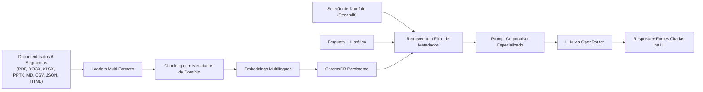

# 🤖 Alura Agente

Agente corporativo de IA que responde em português a perguntas sobre documentos internos de múltiplos segmentos organizacionais.
Ele combina recuperação semântica com geração de texto (RAG), filtragem por domínio corporativo, rastreabilidade de fontes e informa com precisão quando a resposta não consta na base documental do segmento selecionado.

Repositório público: [github.com/alexxnunes/alura-agente](https://github.com/alexxnunes/alura-agente)

---

## 🏢 Segmentos e Domínios Corporativos Suportados

O agente possui documentação completa para **6 segmentos de mercado**, cobrindo **todos os 8 formatos de arquivo** do desafio (PDF, Word, Excel, PowerPoint, Markdown, CSV, JSON e HTML):

1. **💳 Fintech / Banco Digital (*NovaBank*)**
   - Política de privacidade e sigilo bancário (`.pdf`)
   - Termos e condições de uso da conta digital (`.md`)
   - Perguntas frequentes sobre transações e limites Pix (`.json`)
   - Política de segurança e prevenção de fraudes / MED (`.docx`)
   - Tabela de tarifas e comissões (`.xlsx`)
   - Apresentação institucional de governança (`.pptx`)

2. **🛒 Loja Online / E-commerce (*VendaMax*)**
   - Política de privacidade e LGPD (`.md`)
   - Política de reembolso e devoluções CDC (`.pdf`)
   - Perguntas frequentes sobre pagamentos e cupons (`.json`)
   - Guia de envios e prazos de entrega (`.docx`)
   - Termos e condições gerais de compra (`.html`)

3. **💻 SaaS / Plataforma Digital (*CloudSync Pro*)**
   - Base de conhecimento técnico e arquitetura (`.md`)
   - FAQ de suporte e SLAs (`.json`)
   - Política de privacidade e segurança multi-tenant (`.docx`)
   - Tabela de planos e preços (`.xlsx`)
   - Termos de uso de software por assinatura (`.pdf`)

4. **🚚 Empresa de Logística / Envios (*TransLogística*)**
   - Política de envios, cargas e horários de corte (`.pdf`)
   - Procedimento de rastreamento de encomendas (`.md`)
   - Política de reembolsos e sinistros de carga (`.docx`)
   - Perguntas frequentes operacionais (`.json`)
   - Processo de SAC e ouvidoria (`.html`)

5. **🏥 Clínica de Saúde / Consultório Médico (*Vida & Saúde*)**
   - Política de privacidade de dados de pacientes LGPD (`.pdf`)
   - FAQ de consultas, telemedicina e retornos (`.json`)
   - Política de cancelamentos e remarcações (`.md`)
   - Guia de convênios médicos e coberturas (`.xlsx`)
   - Instruções pré e pós-consulta e exames (`.docx`)

6. **🎓 Plataforma Educativa / Escola Online (*Alura Tech Academy*)**
   - Regulamento acadêmico do estudante (`.pdf`)
   - Política de reembolso e cancelamento de matrículas (`.docx`)
   - FAQ de cursos e certificados reconhecidos (`.json`)
   - Guia de uso da plataforma e requisitos (`.md`)
   - Programa de bolsas de estudos e afiliados (`.csv`)

---

## 🎯 Seletor de Domínio na Interface

Ao testar a aplicação, o usuário ou avaliador pode selecionar no menu lateral o segmento desejado (ex: **Fintech**, **E-commerce**, **SaaS**, etc.).
- Quando um segmento específico é escolhido (ex: *Fintech*), o agente **restringe a recuperação semântica estritamente aos documentos daquele domínio**.
- A barra lateral lista os arquivos disponíveis para o segmento e exibe botões com sugestões rápidas de perguntas.
- Caso o usuário pergunte sobre outro tema não coberto pelo segmento selecionado, o agente informa de forma clara que a informação não foi encontrada nos documentos daquele domínio.
- A opção **🌐 Todos os Segmentos** permite consultas integradas em toda a base da empresa.

---

## 🏗️ Arquitetura



---

## 🚀 Executar Localmente

Requer Python 3.11 ou superior.

### Linux / macOS

```bash
python3 -m venv .venv
.venv/bin/python -m pip install -r requirements.txt -r requirements-dev.txt
cp .env.example .env
# Edite .env e configure sua OPENROUTER_API_KEY
.venv/bin/python scripts/generate_docs.py
.venv/bin/python -m src.ingest
.venv/bin/python -m streamlit run app.py
```

### Windows (PowerShell)

```powershell
python -m venv .venv
.\.venv\Scripts\python.exe -m pip install -r requirements.txt -r requirements-dev.txt
Copy-Item .env.example .env
# Edite .env e configure sua OPENROUTER_API_KEY
.\.venv\Scripts\python.exe scripts\generate_docs.py
.\.venv\Scripts\python.exe -m src.ingest
.\.venv\Scripts\python.exe -m streamlit run app.py
```

A interface fica disponível em `http://localhost:8501`.

---

## ⚙️ Configuração (.env)

| Variável | Obrigatória | Padrão | Descrição |
|---|---:|---|---|
| `OPENROUTER_API_KEY` | Sim | — | Chave de API do OpenRouter |
| `OPENROUTER_MODEL` | Não | `meta-llama/llama-3.3-70b-instruct:free` | Modelo LLM principal |
| `OPENROUTER_FALLBACK_MODEL` | Não | `openrouter/free` | Modelo de contingência |
| `EMBEDDING_MODEL` | Não | `paraphrase-multilingual-MiniLM-L12-v2` | Modelo de embeddings |
| `CHUNK_SIZE` | Não | `800` | Tamanho máximo dos chunks de texto |
| `CHUNK_OVERLAP` | Não | `100` | Sobreposição entre chunks |
| `K_RETRIEVAL` | Não | `4` | Quantidade de chunks recuperados por busca |

---

## 💡 Exemplos de Perguntas por Segmento

| Segmento Selecionado | Pergunta de Teste | Resposta Esperada com Base nos Documentos |
|---|---|---|
| **💳 Fintech** | Quais são as tarifas para saques no Banco24Horas? | Até 4 saques gratuitos por mês; R$ 6,50 a partir do 5º saque no mês. |
| **💳 Fintech** | Quais são os limites de transferência Pix diurno e noturno? | Limite diurno (6h às 20h) de R$ 5.000,00 e limite noturno (20h às 6h) de R$ 1.000,00. |
| **🛒 E-commerce** | Qual é o prazo de arrependimento e como funciona a devolução? | Prazo de até 7 dias corridos após o recebimento (CDC), com frete grátis por código de postagem reversa. |
| **💻 SaaS** | Quais são os planos e preços mensais disponíveis? | Starter (R$ 49/mês), Pro (R$ 149/mês) e Enterprise (R$ 499/mês). |
| **🚚 Logística** | Qual é o limite máximo de peso e dimensões por volume? | Peso máximo de 30 kg, comprimento máximo de 105 cm e soma das dimensões de até 200 cm. |
| **🏥 Saúde** | Quais convênios médicos são aceitos na clínica? | Unimed, Bradesco Saúde, Amil, SulAmérica e NotreDame Intermédica. |
| **🎓 Educação** | Quais são os critérios para aprovação e emissão de certificado? | Conclusão de 100% dos módulos em vídeo e aproveitamento mínimo de 75% nas avaliações. |
| **💳 Fintech** | Qual é a política de devolução do e-commerce? *(Pergunta fora do segmento)* | A informação não foi encontrada na documentação do segmento Fintech. |

---

## 🧪 Testes Automatizados

```bash
.venv/bin/python -m pytest tests -q
```

A suíte cobre:
- Leitura correta dos 8 formatos de arquivos (PDF, DOCX, XLSX, PPTX, MD, CSV, JSON, HTML).
- Ingestão, chunking e indexação com metadados de domínio corporativo.
- Reranking léxico e relevância semântica.
- Restrição e filtro de recuperação por domínio corporativo.
- Histórico conversacional e citação de fontes.
- Inicialização segura da interface Streamlit.

---

## 📁 Estrutura do Projeto

```text
app.py                    Interface web Streamlit com seletor de domínios corporativos
src/agent.py              RAG chain, prompts parametrizados por domínio, LLM e fontes
src/config.py             Configurações de ambiente, modelos e parâmetros
src/ingest.py             Chunking, extração de domínio, embeddings e ChromaDB
src/loaders.py            Leitores para os 8 formatos de arquivos
data/docs/                Base documental organizada por segmentos (fintech, ecommerce, saas, logistica, saude, educacao)
scripts/generate_docs.py  Gerador dos documentos em todos os formatos
scripts/smoke_test.py     Teste ponta a ponta via terminal por segmento
tests/                    Suíte de testes automatizados com pytest
deploy/                   Serviço systemd e guia de deploy na OCI Compute
```

---

## ☁️ Deploy na OCI (Oracle Cloud Infrastructure)

O guia completo de implantação está detalhado em [deploy/DEPLOY_OCI.md](deploy/DEPLOY_OCI.md). A aplicação é executada em uma instância **OCI Compute**, com serviço de inicialização contínua via `systemd`.

- Execução local: `streamlit run app.py` → `http://localhost:8501`
- Captura de Tela (execução local): `docs/screenshots/agente_oci.png`

